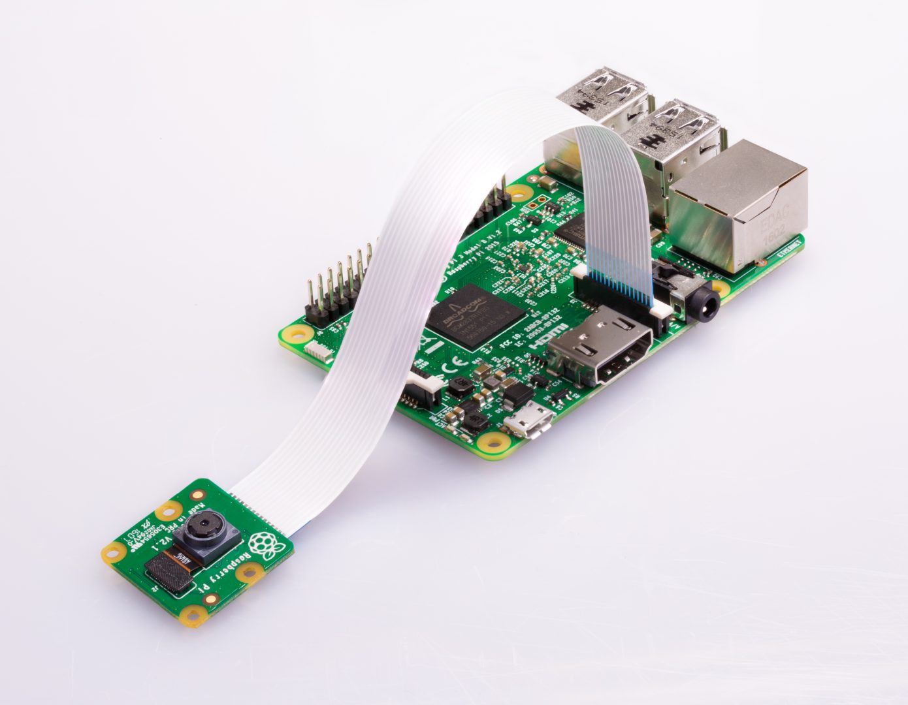
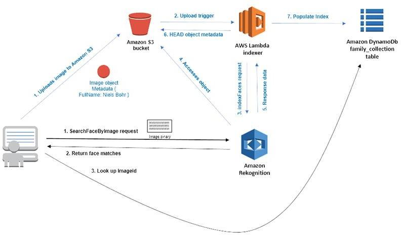

# Attendance-system-using-aws

## PROBLEM STATEMENT:
#### Student’s attendance is usually taken manually by using attendance sheet, given by the faculty member in class. The Current attendance marking methods are monotonous & time consuming. Manually recorded attendance can be easily manipulated. Moreover, it is very difficult to verify one by one student in a large classroom environment with distributed branches whether the authenticated students are actually responding or not.

## THE SOLUTION
#### To tackle the above mentioned issues, we came up with a solution to automate the attendance system using facial recognition system them will be able to save the time and effort this tedious process.

## OBJECTIVE
#### The main objective of the project is to provide an automated attendance system that is practical, reliable and eliminates disturbance and time loss in traditional attendance systems. The primary goal of this project is to develop a cloud-based solution that will automate the attendance taking process in a self-contained classroom environment. The project will consist of three main components: 
#### The Raspberry pie component that will be responsible for uploading  classroom images to AWS for processing.
 #### The Cloud component will be responsible for recognizing students. 
 #### Attendance is finally stored in csv file.

## Hardware Used:

## Cloud Structure

